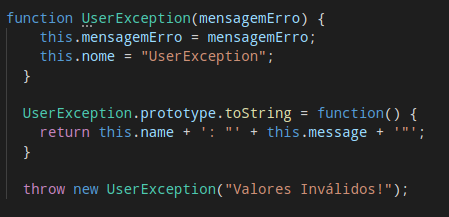
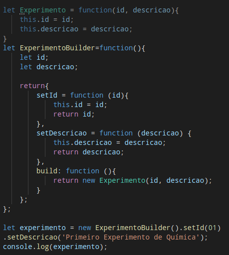

# 
 PADRÕES GoF

### Histórico de versão 

|Data | Versão | Descrição | Autor(es)|
| -- | -- | -- | -- |
| 23.04.2021 | 0.1 | Criação do documento | Bruna Almeida Damarcones Porto|
| 25.04.2021 | 0.1 | Adição da introdução | Bruna Almeida Damarcones Porto|

### Participantes

* Bruna Almeida
* Damarcones Porto

  

### Introdução

Padrões de projeto são soluções padronizadas para um problema recorrente no projeto de sistemas, que seja comprovadamente útil em um determinado contexto. São soluções que independem de tecnologia ou linguagem de programação e ajudam a promover uma boa prática de projeto.
  

Os Design Patterns codificam o conhecimento existente, de forma que possa ser reaplicado em contextos diferentes, além de aprimorar a comunicação entre desenvolvedores. Além disso, tornam projetos OO mais flexíveis, elegantes e reusáveis.
  

O Padrão GoF (Gang of Four) é um repertório de soluções e princípios que ajudam os desenvolvedores a criar software, e que são codificados em um formato estruturado, consistindo em: Nome; Problema que soluciona; e Solução do problema.
  

Existem 23 padrões do GoF, divididos em quatro categorias: criacionais, estruturais e comportamentais, além dos Padrões de classe e Padrões de classe. Para a arquitetura do Software Gama Boyle Lab, foram selecionados os seguintes padrões, que se adequam melhor ao projeto:
 

- Proxy;
- Builder;
- 
- 

Cada padrão será detalhado seguidamente.
 

#### **Proxy**

 

<figcaption align='center'>
    <b>Figura 1 - Tela do menu principal</b>
</figcaption>
 

#### **Builder**

 

<figcaption align='center'>
    <b>Figura 2 - Tela do menu principal</b>
</figcaption>
 

#### **Resultados**

 

#### **Resultados**

 

## Referências
DEVMEDIA, **Design Patterns: Padrões “GoF”**. Disponível em: [devmedia.com.br/design-patterns-padroes-gof/16781](https://www.devmedia.com.br/design-patterns-padroes-gof/16781). Acesso em 24 de abril de 2021.

FACOM, **Padrões GoF**. Disponível em: [facom.ufu.br/~bacala/ESOF/05b-Padr%C3%B5es%20Gof.pdf](http://www.facom.ufu.br/~bacala/ESOF/05b-Padr%C3%B5es%20Gof.pdf). Acesso em 24 de abril de 2021.

MEDIUM, **Design Patterns — Parte 2 — Os Padrões do GOF**. Disponível em: [medium.com/xp-inc/desing-patterns-parte-2-2a61878846d](https://medium.com/xp-inc/desing-patterns-parte-2-2a61878846d). Acesso em 24 de abril de 2021.

BRIZENO, **Classificação dos Padrões de Projeto GoF**. Disponível em: [brizeno.wordpress.com/2011/12/12/classificacao-dos-padroes-de-projeto-gof/](https://brizeno.wordpress.com/2011/12/12/classificacao-dos-padroes-de-projeto-gof/). Acesso em 24 de abril de 2021.