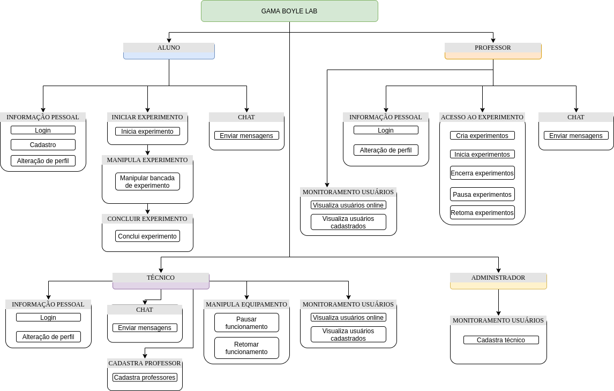

# 
 DIAGRAMA DE ARQUITETURA FUNCIONAL

### Histórico de versão 

|Data | Versão | Descrição | Autor(es)|
| -- | -- | -- | -- |
| 11.05.2021 | 0.1 | Criação do documento | Carlos Eduardo Isadora Galvão|
 

### Introdução

 Os desenvolvedores de sistemas, necessitam de diagramas de arquitetura de sistema para compreender, esclarecer e comunicar ideias acerca da estrutura do sistema e dos requisitos de usuário que o sistema deve ter. É uma estrutura básica que pode ser usada na fase de planejamento do sistema ajudando os parceiros a compreender a arquitetura, discutir as alterações e comunicar claramente as suas intenções.

 

### Metodologia

 A modelagem do diagrama de estados foi desenvolvida utilizando a ferramenta Draw.io pela equipe dos membros de software. Foi elaborado considerando a estrutura da arquitetura.

 

### Diagramas

<figcaption align='center'>
    <b>Figura 1 - Diagrama de Arquitetura Funcional.</b>
</figcaption>
 
