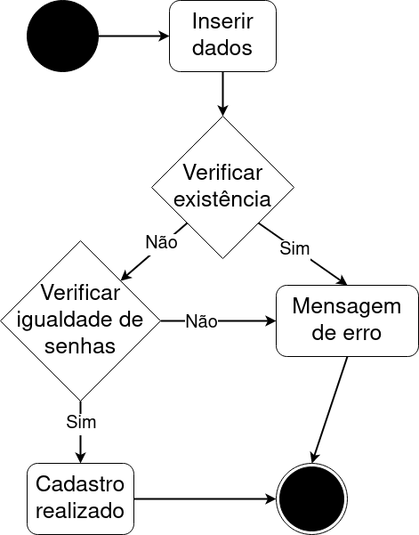
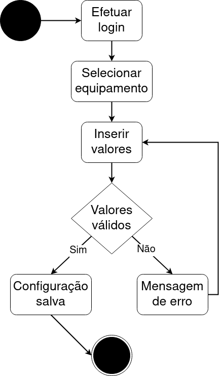
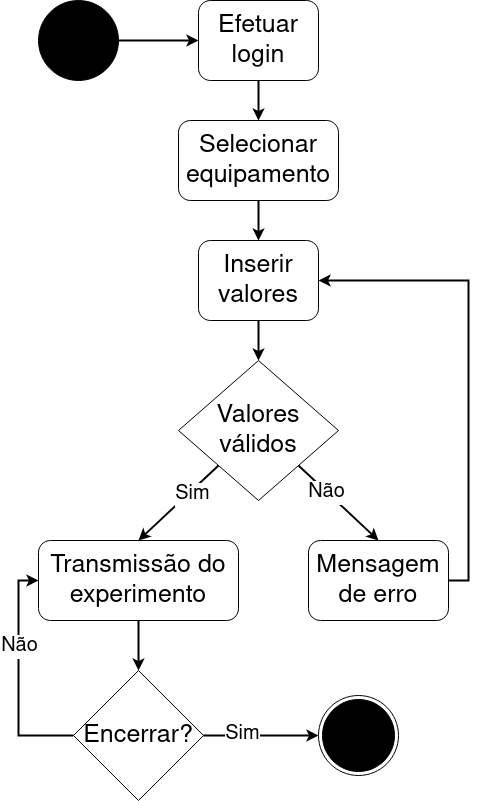

# 
 DIAGRAMA DE ATIVIDADES

### Histórico de versão 

|Data | Versão | Descrição | Autor(es)|
| -- | -- | -- | -- |
| 26.04.2021 | 0.1 | Criação do documento | Bruna Almeida Damarcones Porto|
| 26.04.2021 | 0.2 | Adição dos diagramas | Bruna Almeida Damarcones Porto|

### Participantes

* Bruna Almeida
* Damarcones Porto

  

### Introdução

O Diagrama de atividade é um diagrama definido pela Linguagem de Modelagem Unificada (UML), e representa os fluxos conduzidos por processamentos. É essencialmente um gráfico de fluxo, mostrando o fluxo de controle de uma atividade para outra. Comumente isso envolve a modelagem das etapas sequenciais em um processo computacional.
  
O objetivo do diagrama de atividades é mostrar o fluxo de atividades em um único processo. O diagrama mostra como uma atividade depende da outra.
  
Diagramas de atividade oferecem uma série de benefícios para os usuários, como: Demonstrar a lógica de um algoritmo; Descrever as etapas realizadas em um caso de uso UML; Ilustrar um processo de negócio ou fluxo de trabalho entre usuários e o sistema;  Modelar elementos de arquitetura de software, como método, função e operação.
  
Os símbolos utilizados nos diagrama de atividades do projeto Gama Boyle Lab estão apresentados a seguir:

 

 
<figcaption align='center'>
    <b>Figura 1 - Símbolos utilizados nos diagramas</b>
</figcaption>
 

### Diagramas

#### **Login**

 
<figcaption align='center'>
    <b>Figura 2 - Diagrama de atividades de login</b>
</figcaption>
 

O diagrama apresenta as ações necessárias para que seja possível realizar o login e suas possíveis ações, dependendo do que ocorra na requisição.
 

#### **Cadastro**

 
<figcaption align='center'>
    <b>Figura 3 - Diagrama de atividades de cadastro</b>
</figcaption>
 

O diagrama apresenta como se dará o processo de cadastro dos usuários do tipo aluno.
 

#### **Regulagem de equipamento**

 
<figcaption align='center'>
    <b>Figura 4 - Diagrama de atividades de regulagem de equipamento</b>
</figcaption>
 

O diagrama apresenta como se dará o processo de regulagem do equipamento, por parte do aluno antes de realizar o experimeto ou o técnico a qualquer momento. 

#### **Realização de experimento**

 
<figcaption align='center'>
    <b>Figura 5 - Diagrama de atividades de realização de experimento</b>
</figcaption>
 

O diagrama mostra as ações que levam à realização de um experimento, que pode ser feito pelos três tipos de usuário: aluno, professor e técnico.
 

## Referências
LUCIDCHART, **O que é diagrama de atividades UML?**. Disponível em: [lucidchart.com/pages/pt/o-que-e-diagrama-de-atividades-uml](https://www.lucidchart.com/pages/pt/o-que-e-diagrama-de-atividades-uml). Acesso em 26 de abril de 2021.

UFMG, **Diagrama de Atividades**. Disponível em: [homepages.dcc.ufmg.br/~amendes/GlossarioUML/glossario/conteudo/atividades/diagrama_de_atividades.htm](https://homepages.dcc.ufmg.br/~amendes/GlossarioUML/glossario/conteudo/atividades/diagrama_de_atividades.htm). Acesso em 26 de abril de 2021.

DSC, **Diagrama de Atividades**. Disponível em: [dsc.ufcg.edu.br/~jacques/cursos/map/html/uml/diagramas/atividades/diag_atividades.htm](http://www.dsc.ufcg.edu.br/~jacques/cursos/map/html/uml/diagramas/atividades/diag_atividades.htm). Acesso em 26 de abril de 2021.

Todos os diagramas foram desenvolvidos na plataforma [Draw.io](https://app.diagrams.net/).
