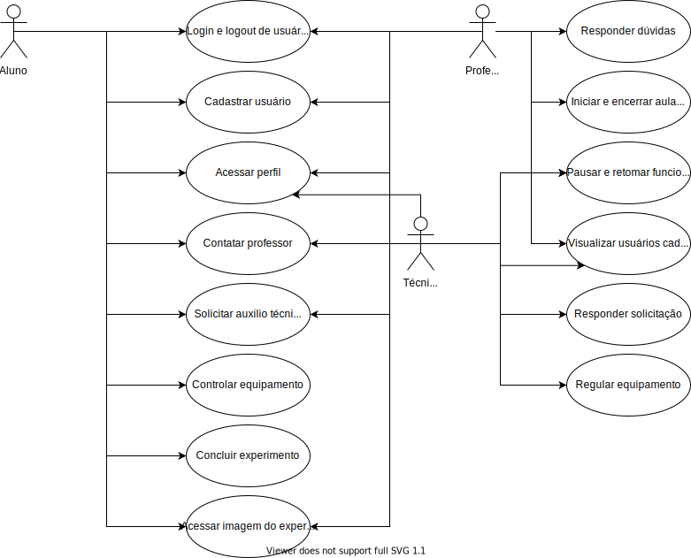

# 
 DIAGRAMA DE CASOS DE USO

### Histórico de versão 

|Data | Versão | Descrição | Autor(es)|
| -- | -- | -- | -- |
| 11.05.2021 | 0.1 | Criação do documento | Rodrigo Oliveira |

### Participantes

* Rodrigo Oliveira

  

### Introdução

O Diagrama de casos de uso é um diagrama definido pela Linguagem de Modelagem Unificada (UML), e representa todas as relações entre os requisitos funcionais junto aos atores to sitema. 
  
O objetivo do diagrama de casos de uso é dar uma visão panorâmica de como os requisitos são compartilhados pelos atores e a inter dependência destes requisitos. 
  

 
<figcaption align='center'>
    <b>Figura 1 - Diagrama de casos de uso</b>
</figcaption>
 
