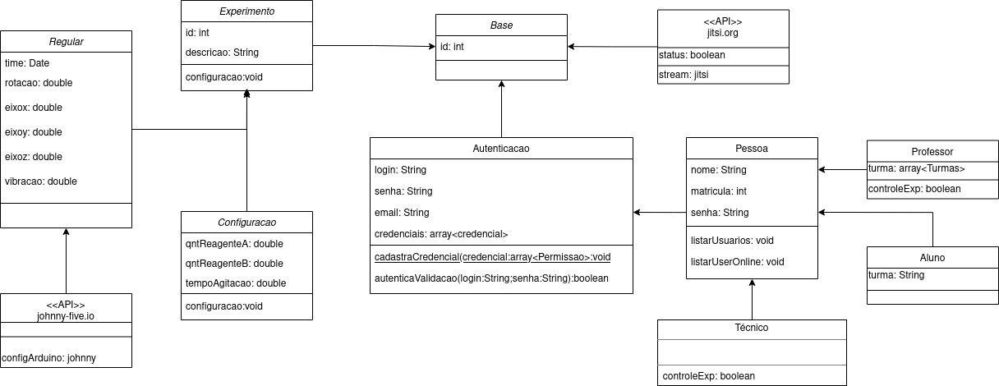

# 
 DIAGRAMA DE CLASSES

### Histórico de versão 

|Data | Versão | Descrição | Autor(es)|
| -- | -- | -- | -- |
| 00.04.2021 | 0.1 | Criação do documento | Bruna Almeida Damarcones Porto João Pedro |

### Participantes

* Bruna Almeida
* Damarcones Porto
* João Pedro

  

### Introdução

um diagrama de classes é uma representação da estrutura e relações das classes que servem de modelo para objetos. Na Unified Modeling Language (UML) em diagrama de classe, uma classe é representada por um retângulo com três divisões, são elas: O nome da classe, seus atributos e por fim os métodos.
  
Considerando a realidade onde o conceito de Classes surgiu, no contexto de produção software, pode-se entender que uma Classe é uma abstração de um objeto da vida real (vida real que será tratada via software), que agrupa dados (atributos) e procedimentos (operações) relacionados ao seu contexto.
  
O diagrama de classes ilustra graficamente como será a estrutura do software, e como cada um dos componentes da sua estrutura estarão interligados.

 

### **Diagrama de classe**
 

 
<figcaption align='center'>
    <b>Figura 1 - Diagrama de classes</b>
</figcaption>
 

## Referências

DEVMEDIA, **Orientações básicas na elaboração de um diagrama de classes**. Disponível em: [devmedia.com.br/orientacoes-basicas-na-elaboracao-de-um-diagrama-de-classes/37224](https://www.devmedia.com.br/orientacoes-basicas-na-elaboracao-de-um-diagrama-de-classes/37224). Acesso em 26 de abril de 2021.

ATÉ O MOMENTO., **Entendendo o Diagrama de Classes da UML**. Disponível em: [ateomomento.com.br/uml-diagrama-de-classes/](https://www.ateomomento.com.br/uml-diagrama-de-classes/). Acesso em 26 de abril de 2021.

MEDIUM, **Compreendendo Diagrama de Classes da UML na prática.**. Disponível em: [medium.com/studio-oceano/compreendendo-diagrama-de-classes-da-uml-na-pr%C3%A1tica-1f7e6422021c](https://medium.com/studio-oceano/compreendendo-diagrama-de-classes-da-uml-na-pr%C3%A1tica-1f7e6422021c). Acesso em 26 de abril de 2021.

MACORATTI, **UML - Diagrama de Classes e objetos**. Disponível em: [macoratti.net/net_uml1.htm](http://www.macoratti.net/net_uml1.htm). Acesso em 26 de abril de 2021.

LUCIDCHART, **O que é um diagrama de classe UML?**. Disponível em: [lucidchart.com/pages/pt/o-que-e-diagrama-de-classe-uml](https://www.lucidchart.com/pages/pt/o-que-e-diagrama-de-classe-uml). Acesso em 26 de abril de 2021.

DCA, **Diagramas de classes UML**. Disponível em: [dca.fee.unicamp.br/cursos/PooJava/desenvolvimento/umlclass.html](https://www.dca.fee.unicamp.br/cursos/PooJava/desenvolvimento/umlclass.html). Acesso em 26 de abril de 2021.

CREATELY, **O Guia Fácil de Diagramas de Classe UML**. Disponível em: [creately.com/blog/pt/diagrama/tutorial-diagrama-de-classes/](https://creately.com/blog/pt/diagrama/tutorial-diagrama-de-classes/). Acesso em 26 de abril de 2021.