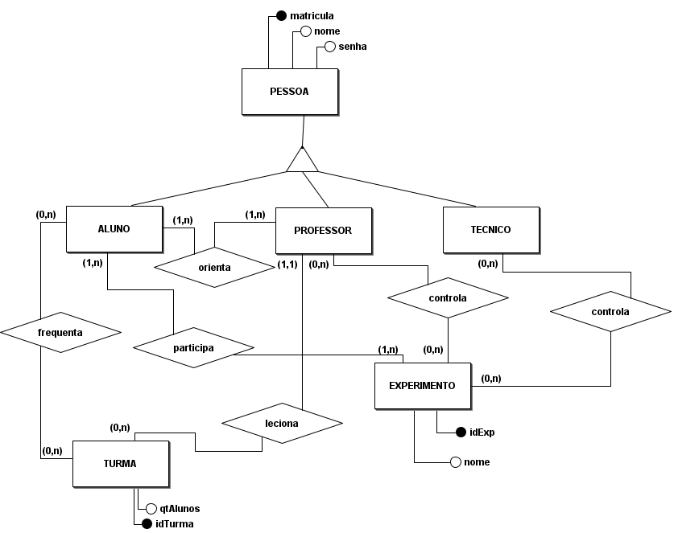

# 
 DIAGRAMA DE ENTIDADE RELACIONAMENTO

### Histórico de versão 

|Data | Versão | Descrição | Autor(es)|
| -- | -- | -- | -- |
| 27.04.2021 | 0.1 | Criação do documento | Isadora Galvão Rodrigo Oliveira|
| 28.04.2021 | 0.2 | Atualização do documento | Isadora Galvão Rodrigo Oliveira|

### Participantes

* Isadora Galvão 
* Rodrigo Oliveira

## Introdução

 
O diagrama entidade relacionamento (ER) é um tipo de fluxograma que ilustra como “entidades”, por exemplo, pessoas, objetos ou conceitos, se relacionam entre si dentro de um sistema. Diagramas ER são mais utilizados para projetar bancos de dados relacionais nas áreas de engenharia de software, sistemas de informações empresariais, educação e pesquisa. Esses diagramas usam um conjunto definido de símbolos, tais como retângulos, diamantes, ovais e linhas de conexão para representar a interconectividade de entidades, relacionamentos e seus atributos. Eles espelham estruturas gramaticais, onde entidades são substantivos e relacionamentos são verbos.

 

### Metodologia

 
O diagrama ER foi desenvolvido pelos alunos de software utilizando a ferramenta brModelo e com os conhecimentos necessários.

 

### Diagrama

<figcaption align='center'>
    <b>Figura 1 - Diagrama de entidade e relacionamento.</b>
</figcaption>
 

## Referências

LUCIDCHART, **O que é um diagrama entidade relacionamento?**. Disponível em : [lucidchart.com/pages/pt/o-que-e-diagrama-entidade-relacionamento/#section_8](https://www.lucidchart.com/pages/pt/o-que-e-diagrama-entidade-relacionamento/#section_8). Acesso em 28 de Abril de 2021.