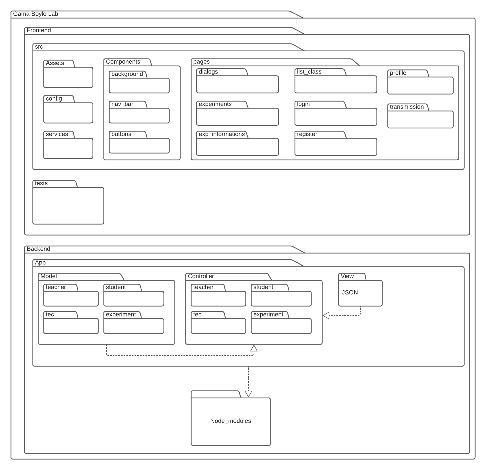

# 
 DIAGRAMA DE PACOTES

### Histórico de versão
|Data | Versão | Descrição | Autor(es)|
| -- | -- | -- | -- |
| 27.04.2021 | 0.1 | Criação do documento | Matheus Calixto Vaz Pinheiro |

### Participantes

* Matheus Calixto Vaz Pinheiro

   

## Introdução

 
Diagramas de pacotes são diagramas usados para demonstrar a organização em forma de pacotes. De modo que sua organização é feita por meio de ilustrações de pastas que correspondem a ferramentas que podem ser agrupadas nesta pasta, assim a pasta tendo que necessariamente ter um nome significativo.
  
Por exemplo a pasta pages corresponderá ao agrupamento das paginas que o usuário verá durante sua experiência com o software.

 

### **Diagrama de Pacotes**

 

<figcaption align='center'>
<b> Figura 1 - Diagrama de pacotes </b>
</figcaption>

## Referências

LUCIDCHART, **Tudo sobre diagramas de pacotes UML**. Disponível em : [lucidchart.com/pages/pt/diagrama-de-pacotes-uml](https://www.lucidchart.com/pages/pt/diagrama-de-pacotes-uml). Acesso em 27 de Abril de 2021.