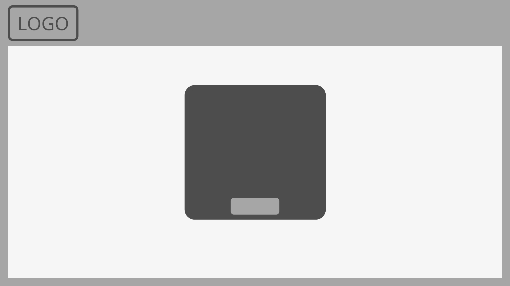
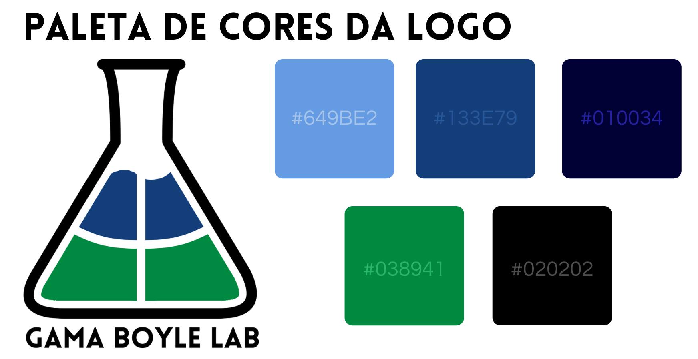

# 
 GUIA DE ESTILO

### Histórico de versão 

|Data | Versão | Descrição | Autor(es)|
| -- | -- | -- | -- |
| 20.04.2021 | 0.1 | Criação do documento | Bruna Almeida |
| 24.04.2021 | 0.2 | Adição das imagens | Bruna Almeida |
| 24.04.2021 | 0.3 | Adição dos textos | Bruna Almeida |

### Participantes

* Bruna Almeida

 

### Introdução

 O guia de estilo trata de um registro das principais decisões de design tomadas, de forma que elas não se percam, isto é, sejam efetivamente incorporadas no produto final. Guias de estilo servem de ferramenta de comunicação entre os membros da equipe de design e também com a equipe de desenvolvimento. É importante que as decisões de design possam ser facilmente consultadas e reutilizadas nas discussões sobre extensões ou versões futuras do produto.

  

O guia de estilo dedicado ao projeto Gama Boyle Lab foi desenvolvido a partir da <a href="https://damarcones.github.io/Gama_Boyle_Lab/visao-geral/">Identidade Visual</a> do projeto e o <a href="https://damarcones.github.io/Gama_Boyle_Lab/ihc/prototipo-alta/">protótipo de alta-fidelidade</a>.

 

### 1 RESULTADOS DE ANÁLISE

#### 1.1 Descrição do ambiente de trabalho do usuário

Ao acessar o site, o usuário se depara com a tela inicial que contém um quadro, onde é preciso identificar-se como aluno, professor ou técnico. Logo depois, o usuário é direcionado à tela de login e cadastro. Em seguida, é apresentado um menu de funcionalidades disponíveis para o usuário. Para o perfil de aluno, está disponível os expermimentos a serem realizados. Já para o professor e o técnico, além dos mesmos experimentos disponíveis, existem outras funcionalidades à disposição.

  

Existe uma característica que diferencia cada um dos perfis da aplicação: o perfil de aluno tem o fundo azul claro; o de professor possui o fundo azul escuro; e o perfil de técnico detem o fundo verde. Já as telas que são comuns aos três perfis possuem o fundo de cor branca.

  

Na maior parte das telas, é apresentado uma barra superior com: a logo do projeto; um botão que direciona para o perfil do usuário; uma barra de pesquisa; e um botão de logout, que encaminha o usuário para a tela de login.

 

### 2 ELEMENTOS DE INTERFACE

#### 2.1 Disposição espacial e grid

As telas iniciais - de identificação, login e cadastro - seguem um padrão bem igual, com a barra superior contendo apenas a logo e área de interação fica no centro da tela.
 

<figcaption align='center'>
    <b>Figura 1 - Grid das telas iniciais</b>
</figcaption>
 

A tela principal possui vários itens de interação. Na barra superior há a logo, o botão que direciona para o perfil de usuário, uma barra de pesquisa e botão de Logout. Essa tarefa varia entre os perfis de aluno, professor e técnico.
 

<figcaption align='center'>
    <b>Figura 2 - Tela do menu principal</b>
</figcaption>
 

#### 2.2 Janelas

As janelas presentes na aplicação incluem: informações sobre o experimento selecionado; regulação de equipamento; tela de transmissão de experimento; listagem de alunos; e tela de confirmação de decisão. A disposição de elementos dessas janelas estão apresentados a seguir.
 

<figcaption align='center'>
    <b>Figura 3 - Janela de informações</b>
</figcaption>
 

<figcaption align='center'>
    <b>Figura 4 - Tela de transmissão de experimento - aluno</b>
</figcaption>
 

<figcaption align='center'>
    <b>Figura 5 - Tela de transmissão de experimento - professor/técnico</b>
</figcaption>
 

<figcaption align='center'>
    <b>Figura 6 - Janela de confirmação de decisão</b>
</figcaption>
 

#### 2.3 Tipografia

Em relação à tipografia, a aplicação utilizará as seguintes fontes:
 

 
<figcaption align='center'>
    <b>Figura 7 - Tipografia</b>
</figcaption>
 

#### 2.4 Símbolos não tipográficos

Os seguintes símbolos serão utilizados na aplicação:
 

 
<figcaption align='center'>
    <b>Figura 8 - Símbolos não-tipográficos</b>
</figcaption>
 

Estes símbolos executam, respectivamente, as seguintes funções:

- Mostrar o perfil do usuário;
- Fazer Logout;
- Confirmar uma decisão;
- Representação do Chat;
- Dar continuidade a um experimento;
- Pausar um experimento;
- Enviar uma mensagem no chat.

  

#### 2.5 Cores

A logo do projeto deverá ser usada em quase todas as telas da aplicação.
 

 
<figcaption align='center'>
    <b>Figura 9 - Paleta de cores da Logo</b>
</figcaption>
 

No percorrer da aplicação as seguintes cores devem ser utilizadas:
 

 
<figcaption align='center'>
    <b>Figura 10 - Paleta de cores do site</b>
</figcaption>
 

### 3 ELEMENTOS DE INTERAÇÃO

#### 3.1 Estilos de interação

Os estilos de interação que serão utilizados são: menus, que possibilitam a navegação do usuário pelo site com uma linguagem natural que indica o que o usuário pode fazer; e WIMP (window, icon, menu, pointing device) que é a utilização de ícones, menus e ações com o mouse.

 

#### 3.2 Seleção de um estilo

Como citado anteriormente, o estilo de utilização de menus será o predominante na aplicação. Dessa forma o usuário seleciona no menu a funcionalidade que deseja e é guiad até a finalização da tarefa.

 

#### 3.3 Aceleradores

Não há nenhum de acelerador ou tecla de atalho na aplicação.
 

### 4 ELEMENTOS DE AÇÃO

#### 4.1 Preenchimento de campos

As telas de login e cadastro exigem preenchimento de campos. No caso de cadastro, serão solicitados: nome, matrícula, turma, senha e confirmação de senha. Já na tela de login, serão exigidos matrícula ou usuário e a senha cadastrada.

 

#### 4.2 Seleção

Não existe opção de seleção nos preenchimentos de campos, apenas caixas de texto.

 

#### 4.3 Ativação

Após todos os campos preenchidos corretamente, basta o usuário clicar no botão "entrar" (no caso de login) ou "cadastrar" (em caso de cadastro).

 

### 5 VOCABULÁRIO E PADRÕES

#### 5.1 Terminologia

A linguagem utilizada na aplicação deve ser bem simples e de fácil entendimento, contendo termos ligados à Química Experimental.
 

#### 5.2 Tipos de tela

A aplicação deve possuir um padrão em quase todas as telas, com uma barra superior contendo a Logo e alguns botões. A excessão será as telas de transmissão de experimento, que não devem possuir barra superior, apenas a tela de transmissão, chat e alguns botões.
 

#### 5.3 Sequências de diálogos

Nos casos que necessitam algum tipo de confirmação, o sistema informará o usuário com algum aviso na tela do site, solicitando a confirmação da decisão.
 

## Referências

Livro: BARBOSA, S. D. J.; SILVA, B. S., **Interação Humano-Computador** . 1ª edição, Rio de Janeiro: Elsevier, 2010. Acesso em 19 de abril de 2021.

IHC, **Guia de Estilo**. Disponível em [https://interacao-humano-computador.github.io/2020.1-Prefeiturade-Aguas-Lindas-de-Goias/analise_requisitos/guia_estilo/](https://interacao-humano-computador.github.io/2020.1-Prefeiturade-Aguas-Lindas-de-Goias/analise_requisitos/guia_estilo/). Acesso em 20 de abril de 2021.