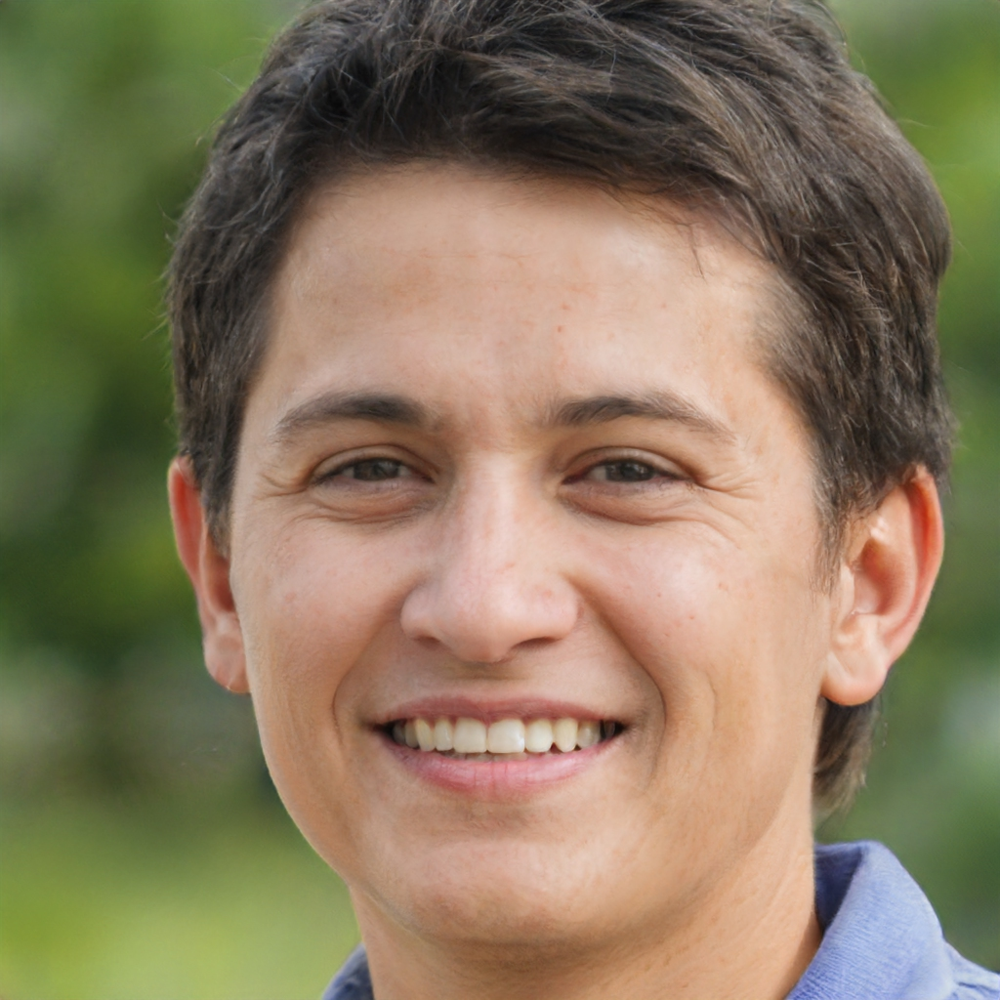
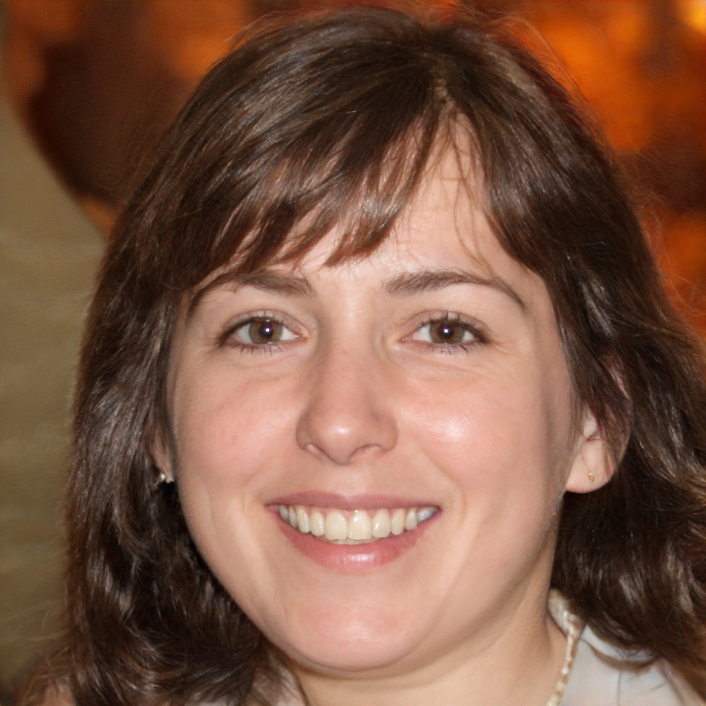
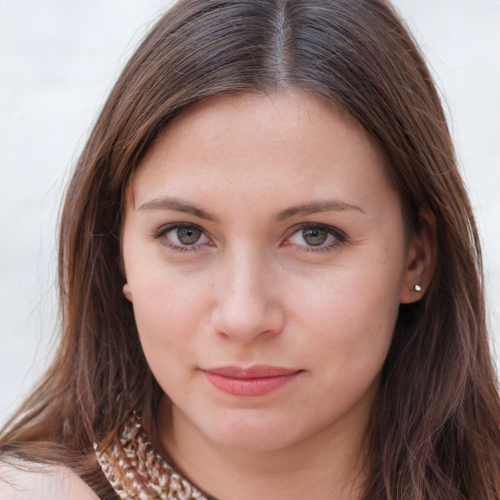
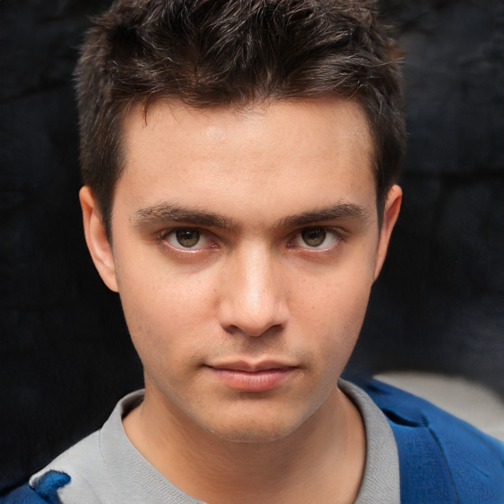

# 
 PERSONAS

### Histórico de versão

|Data | Versão | Descrição | Autor(es)|
| -- | -- | -- | -- |
| 21.04.2021 | 0.1 | Criação do documento | João Pedro Chaves |

### Participantes

* João Pedro Chaves
 

### Personas

<figure style="float:left;margin-right:16px;">
  
</figure>

#### Paulo Carvalho, técnico
Paulo Carvalho, de 30 anos, é técnico do laboratório de Química da Universidade de Brasília há 2 anos. Ele tem facilidade em utilizar novas plataformas e gosta de se manter atualizado sobre a sua área de atuação. Paulo busca responder às solicitações dos alunos e dos professores o mais rápido possível.
  

<figure style="float:left;margin-right:16px;">
  
</figure>

#### Carla Silva, professora
Carla Silva, de 42 anos, é professora da Universidade de Brasília há cinco anos e já lecionou diversas disciplinas diferentes. Ela sempre busca proporcionar, em suas aulas, o maior contato possível dos alunos com os equipamentos, vidrarias e materiais dos experimentos, pois acredita que isso aumenta o engajamento na matéria e auxilia no aprendizado.  
 

<figure style="float:left;margin-right:16px;">
  
</figure>

#### Alessandra Gonçalves, aluna
Alessandra Gonçalves, de 19 anos, é aluna de Química Geral Experimental e aprende mais quando está exercendo um papel ativo na matéria. Apesar de gostar da matéria, ela tem dificuldades em alguns experimentos e não hesita em solicitar auxílio do professor ou do técnico do laboratório. 
  

### Anti Persona

<figure style="float:left;margin-right:16px;">
  
</figure>

#### Gabriel Andrade, internauta
Gabriel Andrade, de 16 anos, é aluno do ensino médio e tem como hobby navegar pela internet. Ele é muito curioso e sempre que encontra um site novo, tenta utilizar da maneira que for possível, às vezes faz algumas brincadeiras aproveitando falhas dos sites.
 

## Referências
 BARBOSA, S. D. J.; SILVA, B. S., **Interação Humano-Computador** . 1ª edição, Rio de Janeiro: Elsevier, 2010. Acesso em 21 de abril de 2021.