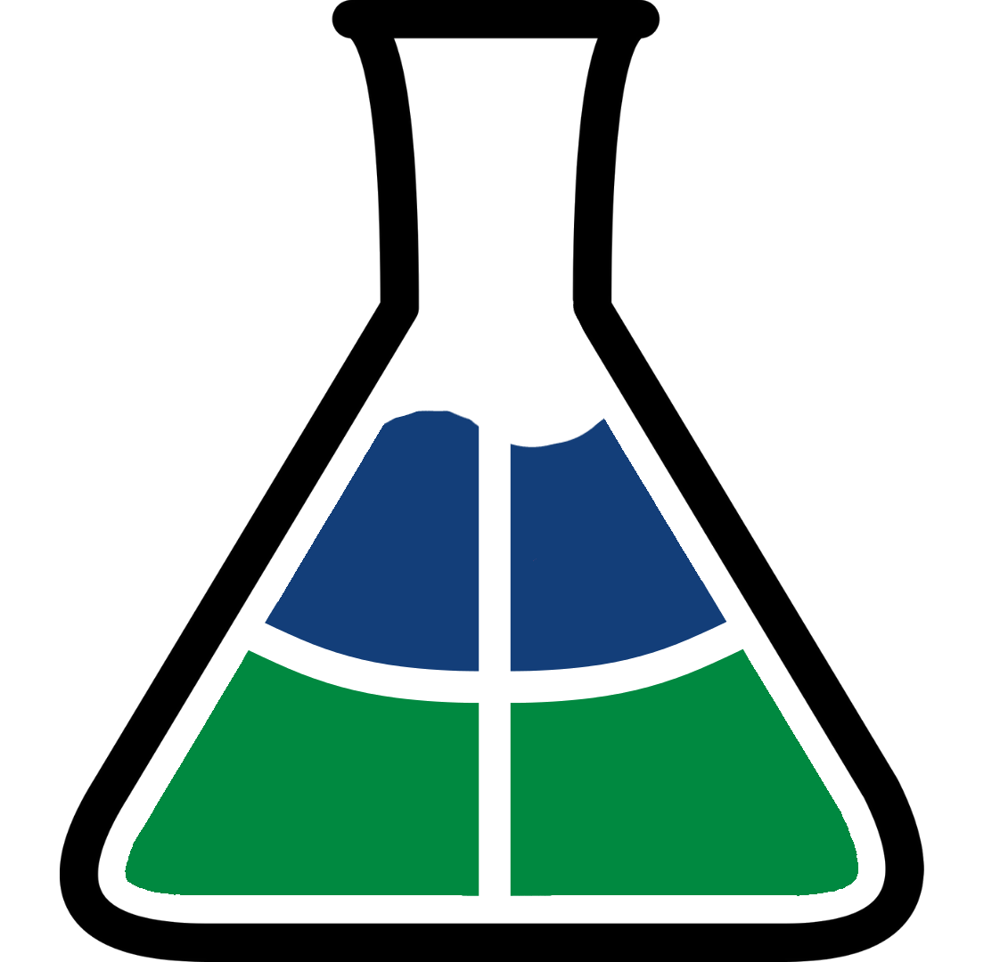
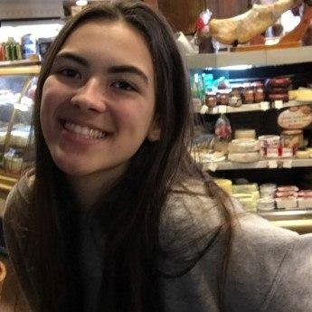

# 
 GAMA BOYLE LAB

 

Repositório destinado à documentação do núcleo de Software do projeto <b>Gama Boyle Lab</b>, para a matéria Projeto Integrador I, da Universidade de Brasília, Campus do Gama.
  

O objetivo do produto Gama Boyle Lab é auxiliar estudantes na execução de experimentos da área de Química de maneira remota. Para alcançar este objetivo, é proposto um artefato que consiste em uma estrutura de componentes eletrônicos controlados remotamente por um software dedicado.
  

Esta WIKI tem a finalidade de documentar os artefatos ligados à estrutura do Software, que será a ponte entre o equipamento físico e os usuários que estarão envolvidos nos experimentos.

 

## Equipe

A equipe (grupo 1/Turma 03A) é composta por 17 membros, das cinco engenharias da FGA: Software, Eletrônica, Energia, Aeroespacial e automotiva. Os membros foram divididos em três núcleos do projeto: 

### Software

  <figure style="float:left;margin-right:16px;">
    
    <figcaption>Bruna Almeida</figcaption>
  </figure>

<figure style="float:left;margin-right:16px;">
  
  <figcaption text-align="center">Carlos Fiuza</figcaption>
</figure>

<figure style="float:left;margin-right:16px;">
  
  <figcaption align="center">Damarcones Porto</figcaption>
</figure>

<figure style="float:left;margin-right:16px;">
  
  <figcaption align="center">Isadora Galvão</figcaption>
</figure>

<figure style="float:left;margin-right:16px;">
  
  <figcaption align="center">João Pedro</figcaption>
</figure>

<figure style="float:left;margin-right:16px;">
  
  <figcaption align="center">Matheus Pinheiro</figcaption>
</figure>

<figure style="float:left;margin-right:16px;">
  
  <figcaption align="center">Rodrigo Oliveira</figcaption>
</figure>

 

### Estrutura

* Ismael Andrade
* Paulo Vitor
* Matheus de Avila
* Renata Freitas

### Eletrônica

* Ana Luiza Brito
* Leonardo Takehana
* Letícia Ribeiro
* Rodrigo Balbino
* Thiago Sampaio
* Victor Hugo

### Líderes

|Product Owners|Scrum Masters|Gerente|Vice-gerente|
|:---|:---|:---|:---|
|Ana Luiza Brito Renata Freitas</h5>|Matheus de Avila Rodrigo Balbino|Damarcones Porto|Thiago Sampaio|

