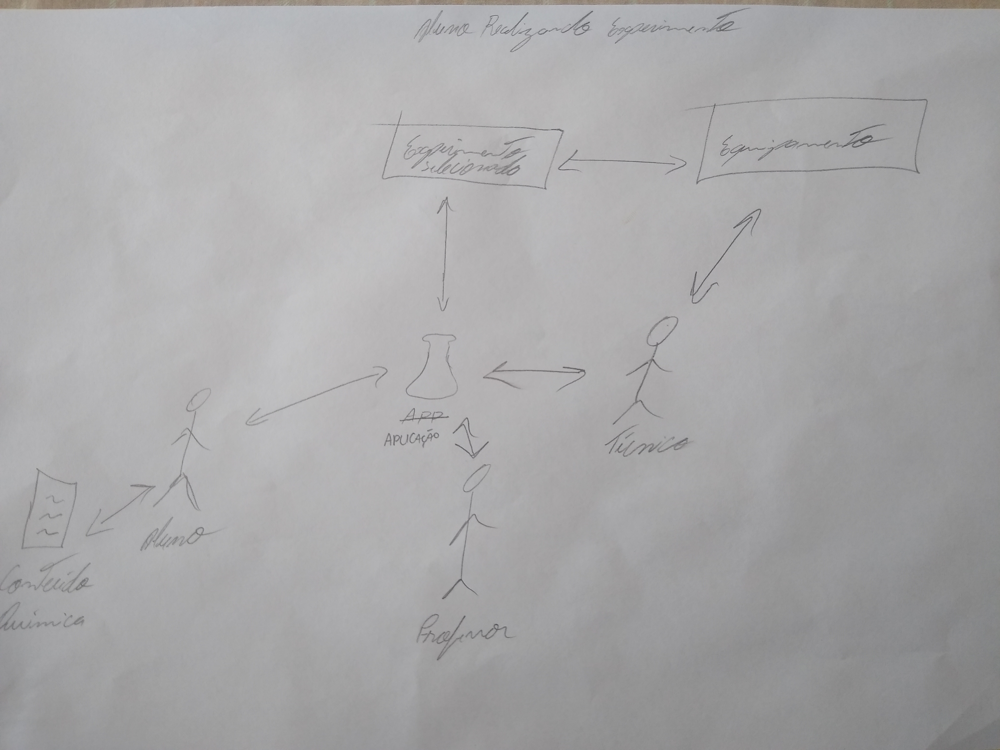
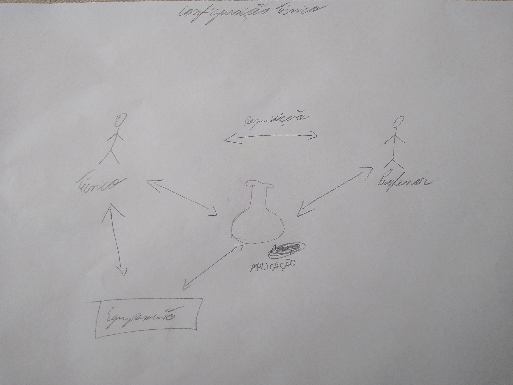

# 
 RICHPICTURES

### Histórico de versão 

|Data | Versão | Descrição | Autor(es)|
| -- | -- | -- | -- |
| 24.04.2021 | 0.1 | Criação do documento | Damarcones Porto |

### Participantes

* Damarcones Porto

 

### Introdução

Um Rich Picture é um desenho de uma situação que ilustra os principais elementos e relações que precisam ser considerados na tentativa de trazer uma melhor compreensão do problema a ser resolvido pela equipe de desenvolvimento. É composto de figuras, textos, símbolos e ícones, todos eles utilizados para ilustrar graficamente a situação. É chamado de Rich Picture porque ilustra a riqueza e a complexidade de uma situação.

 

No Projeto Gama Boyle Lab, as Rich Pictures demonstram de forma geral - e em alguns casos de maneira específica - como ocorre a interação entre o aplicativo Web, banco de dados e seus usuários.

### Rich Pictures

Em sua maioria, as Rich Pictures foram desenvolvidas à mão, pois com esse método a interação entre os integrantes e o desenvolvimentos do artefato da-se de maneira mais rápida e clara.

#### Visão Geral da Aplicação

<figcaption align='center'>
    <b>Figura 1 - Visão Geral da Aplicação.</b>
</figcaption>
 

De forma geral, o funcionamento da aplicação é ilustrada na imagem acima, onde a aplicação está no centro da imagem e os atores envolvidos estão ao redor dela. Os usuários do tipo técnico, professor e aluno podem se comunicar entre si atráves da aplicação ou outro meio externo. O técnico controla o equipamento tanto fisicamente quanto pela aplicação, configurando por uma interface disponibilizada pela aplicação, tendo acesso a comandos salvos em um banco de dados facilitando a configuração do Arduino Mega que controla todo o equipamento físico, assim sendo necessário apenas informar valores sem a necessidade de reprogramar todo o Arduino Mega.

 

#### Aluno Realizando Experimento

<figcaption align='center'>
    <b>Figura 2 - Realização de experimento pelo usuário ALuno.</b>
</figcaption>
 

O usuário do tipo Aluno realiza um experimento que foi solicitado anteriormente pelo professor da disciplina. Quando o Aluno efetuar login, selecionará um dos experimentos listados e fará as configurações especificas do experimento desejado, por fim iniciando a execução do mesmo no equipamento, ao final do experimento o Aluno sairá da aplicação dando espaço para o próximo na fila de realização de experimentos.

 

#### Técnico Configurando Equipamento

<figcaption align='center'>
    <b>Figura 3 - Configuração do Equipamento pelo técnico</b>
</figcaption>
 

O usuário do tipo Técnico, pode realizar uma configuração de equipamento vinda de uma solicitação ou não, sendo essa solicitação feita através da aplicação ou outro meio de comunicação. A configuração pode ser mecânica ou lógica, caso seja preciso reposicionar alguma parte do equipamento, o tècnico fará isso de maneira direta, mas caso seja necessário um ajuste de programação, a aplicação disponibilizará um ambiente que torna isso possível, sem a necessidade de programar totalmente o equipamento.

 

## Referências

BETTEREVALUATION, **Rich Pictures**. Disponível em [betterevaluation.org/en/evaluation-options/richpictures](https://www.betterevaluation.org/en/evaluation-options/richpictures). Acesso em 24 de abril de 2021.

MSP, **Rich Picture**. Disponível em [mspguide.org/tool/rich-picture](http://www.mspguide.org/tool/rich-picture). Acesso em 24 de abril de 2021.

REQUISITOS, **Rich Pictures**. Disponível em [www.mspguide.org/tool/rich-picture](http://www.mspguide.org/tool/rich-picture). Acesso em 24 de abril de 2021.